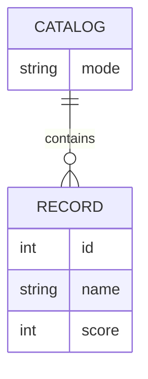

# Domain Model

The domain is a single catalog of scored records that Service2 serves whole, in one of
two modes, and that Service1 reads to compute an aggregate.

`CATALOG` is Service2's single, fixed catalog: it holds `mode` (`full` or `empty`) and,
in full mode, exactly the ten seeded `RECORD` rows; in empty mode, none. There is only
ever one catalog — it is not a collection of catalogs a caller picks among.