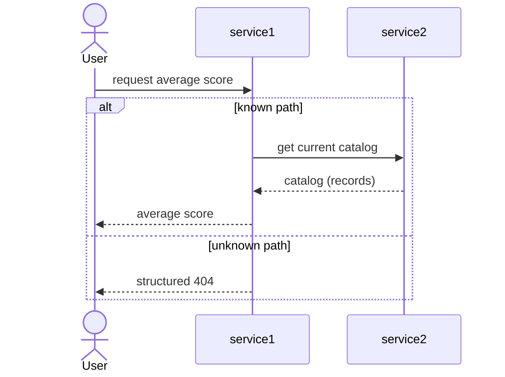

# Get the average score

A User calls Service1 for the average score of Service2's current catalog; a request to
a path Service1 does not serve gets a structured 404 instead.

```mermaid
sequenceDiagram
    actor User
    participant service1
    participant service2

    User->>service1: request average score
    alt known path
        service1->>service2: get current catalog
        service2-->>service1: catalog (records)
        service1-->>User: average score
    else unknown path
        service1-->>User: structured 404
    end
```

